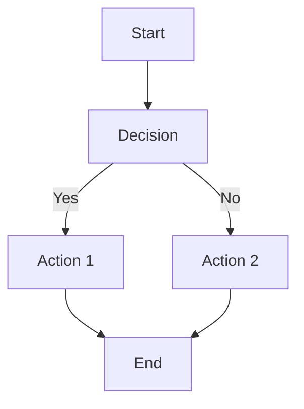
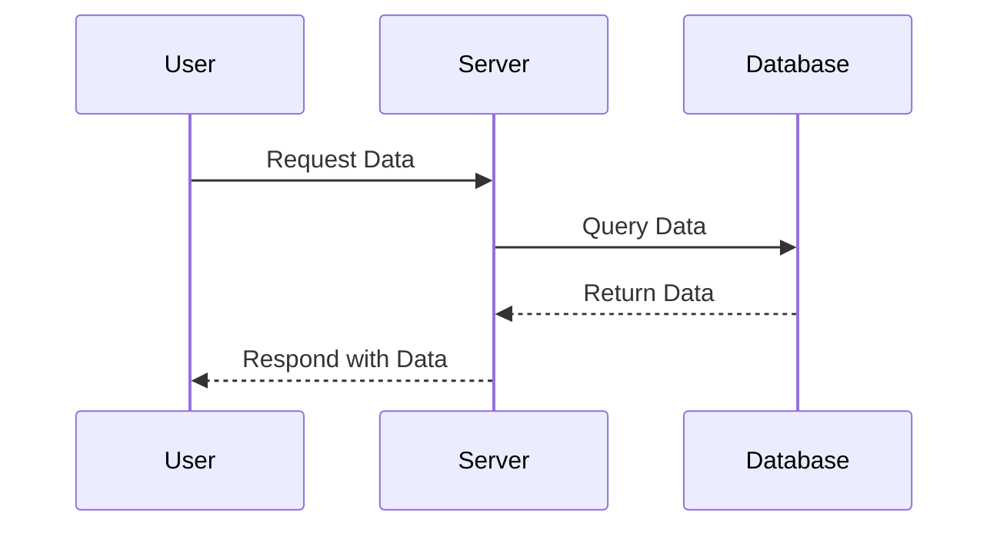
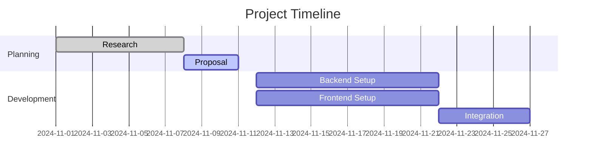
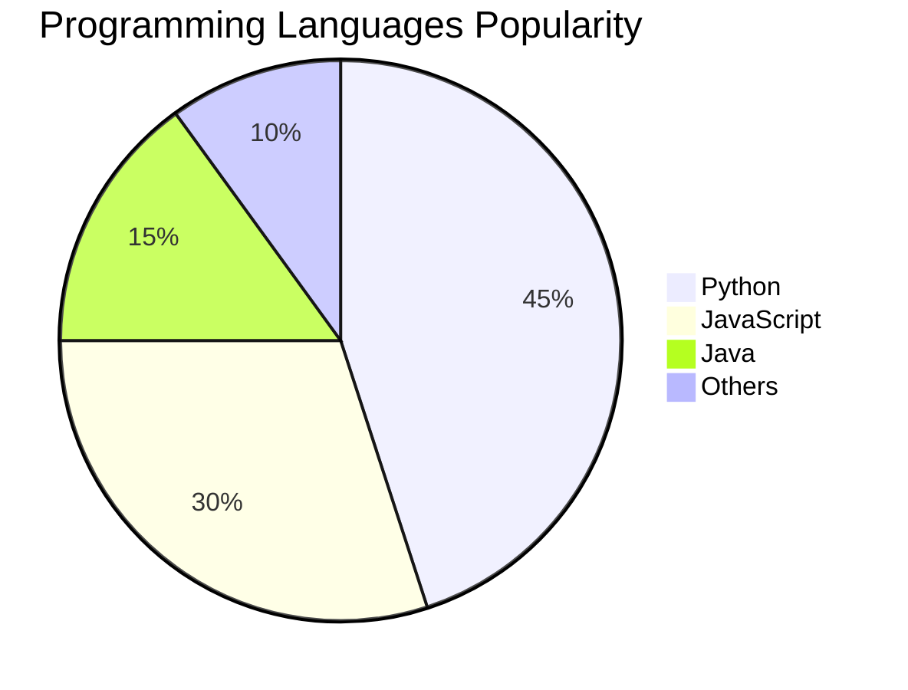
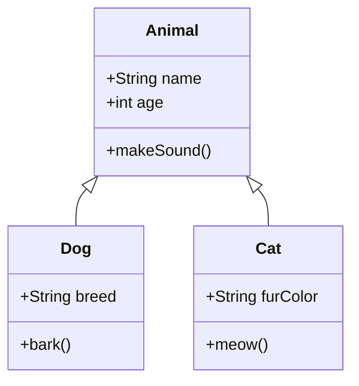

#TIL #스파르타코딩클럽 [[2411]]

## 1. Mermaid
### Mermaid
- Markdown에서 다이어그램과 차트를 생성할 수 있는 도구
- 코드 블록 내에 간단한 언어로 정의하여 시각적인 내용을 표현 가능하게 해줌
- 개발 문서, 프레젠테이션, 또는 협업 중 시각적인 구조나 흐름을 명확히 표현하는 데 유용

### Mermaid 작성법과 다양한 다이어그램 예시
#### 1. Flowchart (흐름도)
- `graph TD`(위에서 아래) 또는 `graph LR`(왼쪽에서 오른쪽)을 사용

- **문법**
	- \--> : 단방향 화살표
	- \---> : 무화살표 연결
	- \-.-> : 점선 화살표
	- \==> : 굵은 화살표

- 예시

#### 2. Sequence Diagram (시퀀스 다이어그램)
- 작업의 순서를 나타낼 때 사용

- **문법**
	- `participant`: 참여자 정의
	- \->> : 메시지 송신
	- \--> : 응답 송신

- 예시

#### 3. Gantt Chart (간트 차트)
- 프로젝트 계획과 일정을 시각적으로 나타낼 때 유용

- **문법**
	- `dateFormat YYYY-MM-DD` : 날짜 형식 지정
	- `section` : 섹션 구분
	- `task_name : state, start_date, duration`

- 예시

#### 4. Pie Chart (파이 차트)
- 데이터 비율을 시각화할 때 사용

- **문법**
	- `pie` : 파이 차트 선언
	- `title` : 제목
	- `value : label`

- 예시

#### 5. Class Diagram (클래스 다이어그램)
- 객체 지향 설계에서 클래스와 그 관계를 나타낼 때 사용

- **문법**
	- `class` : 클래스 정의
	- \<|-- : 상속 관계

- 예시

